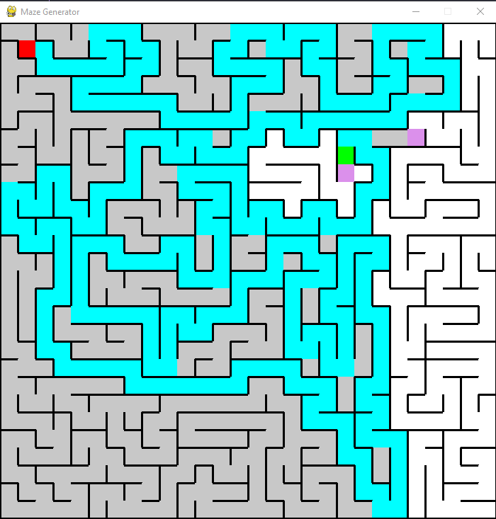
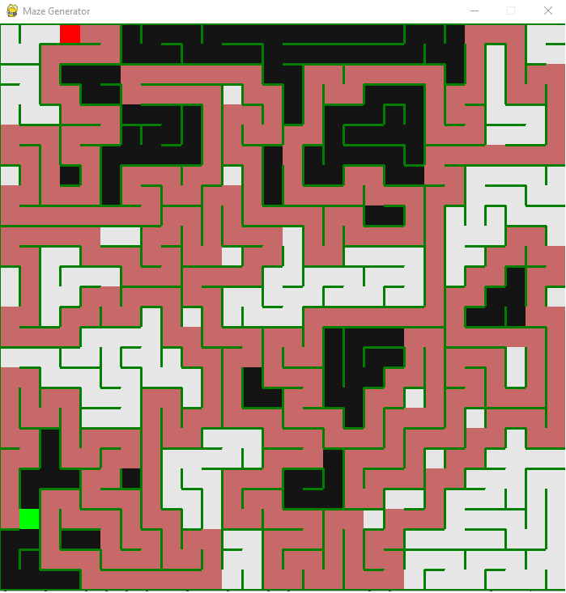
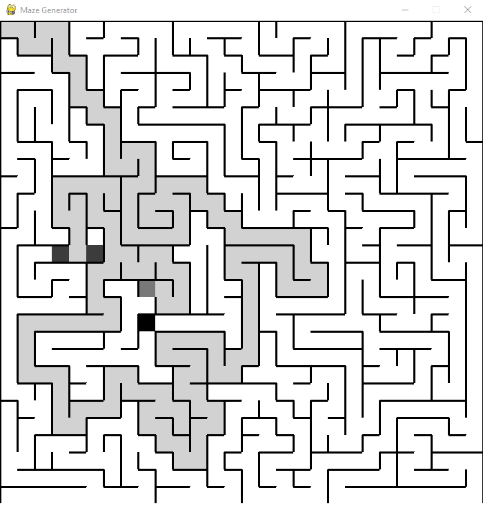

# Labirintite

**Conteúdo da Disciplina**: Grafos 1

## Alunos

| Matrícula  | Aluno                            |
| ---------- | -------------------------------- |
| 18/0054082 | Marcelo Victor de Sousa Silva    |
| 18/0029223 | Washington Bispo Arishita Junior |

## Sobre

O projeto labirintite tem como objetivo demonstrar visualmente a diferença entre a forma de busca DFS e BFS em um labirinto, de maneira a chegar em um objetivo gerado aleatóriamente em algum local do labirinto.

## Screenshots





## Instalação

**Linguagem**: Python

**Framework**: PyGames

Para rodar o projeto é necessário que tenha o python3 instalado na máquina e o pygames.
O pygames pode ser obtido a partir do seguinte link:

<https://www.pygame.org/wiki/GettingStarted#Pygame%20Installation>

## Uso

Para iniciar o projeto é necessário utilizar o comando na raíz do projeto:

```
python main.py
```

em seguida irá aparecer um console com três opções e a interface com o labirinto.

No console se digitar o número 1 e clicar enter o sistema tentará encontrar o caminho para o labirinto utilizando DFS, se digitar o número 2 e clicar enter o sistema utilizará BFS e por fim se digitar o número 3 e clicar enter o tema de cores do labirinto será alterado.

Seguido a isso clique no console o botão enter para visualizar o caminho que será realizado pelo algoritimo para tentar chegar no objetivo gerado.

obs: é necessário que o projeto seja executado em um sistema com interface gráfico por conta do pygames, então se executado pelo wsl não irá funcionar.

## Apresentação

O link da apresentação pode ser encontrado no seguinte link:

<https://www.youtube.com/watch?v=xncKnU-DvGw>
